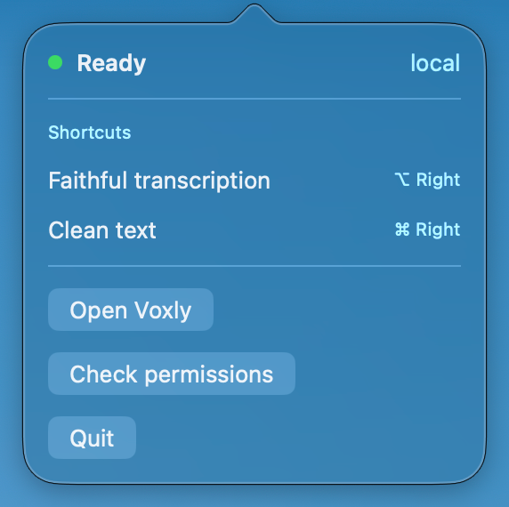
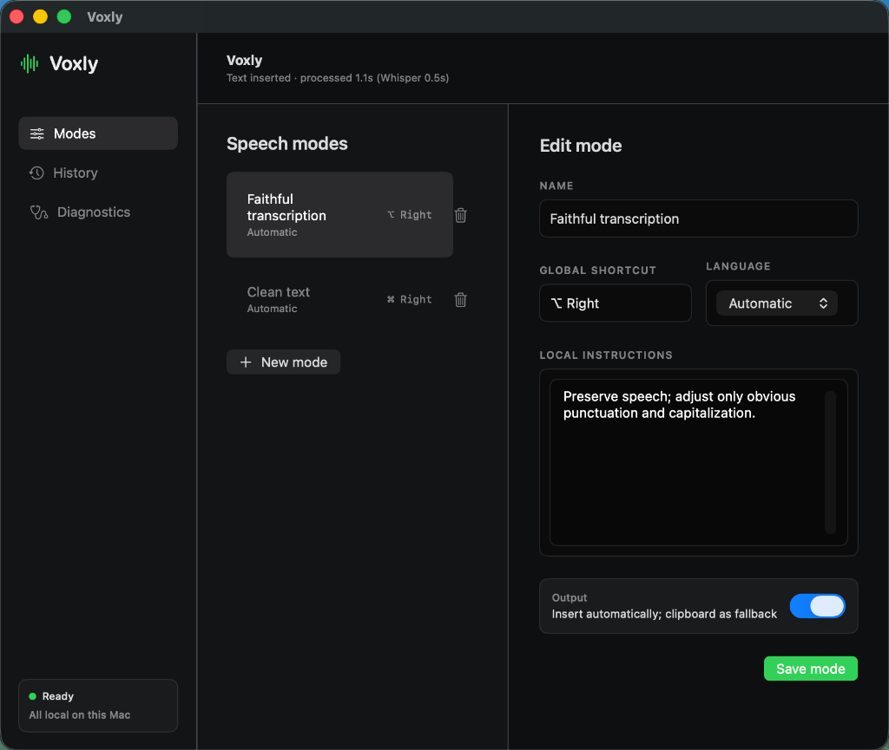
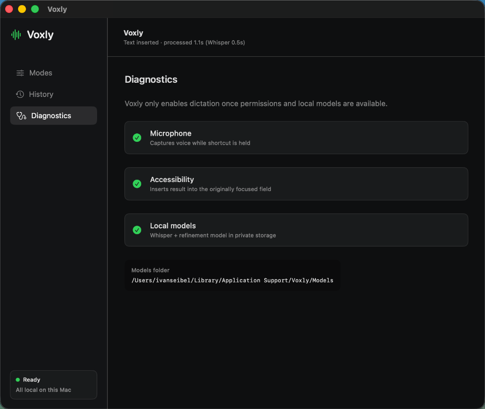
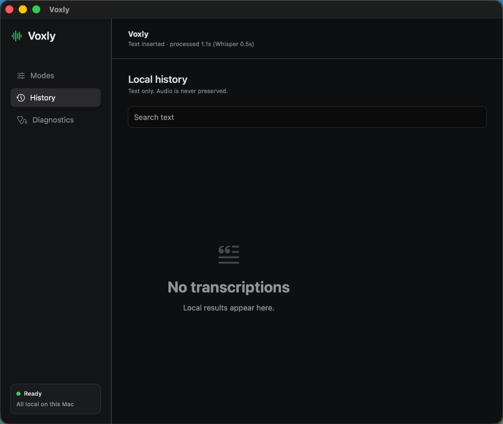

<div align="center">
  
  <h1>Voxly</h1>
  <p><b>Fast, private, push-to-talk voice dictation and text refinement for macOS.</b></p>

  <p>
    <a href="#overview">Overview</a> •
    <a href="#key-features">Features</a> •
    <a href="#quick-start">Quick Start</a> •
    <a href="#shortcuts--modes">Shortcuts & Modes</a> •
    <a href="#local-engines--architecture">Local Engines</a> •
    <a href="#contributing">Contributing</a>
  </p>
</div>

---

## Overview

**Voxly** is a lightweight, privacy-first macOS application for voice dictation. Hold a global shortcut key, speak, and release — Voxly transcribes your speech and inserts the result directly into your active text field.

Voxly runs entirely on your Mac using hardware-accelerated (arm64 / Metal) local AI engines. **No audio or text ever leaves your machine.**

<div align="center">
  
  <br>
  <sub><i>Menu bar popover showing status, active modes, and quick actions</i></sub>
</div>

---

## ✨ Key Features

- **Push-to-Talk Dictation:** Hold a global modifier key to record, release to transcribe and insert directly into the active app.
- **100% Local & Private:** Transcribes locally via `whisper.cpp` and refines text via `llama.cpp`. Audio buffers are deleted immediately after processing.
- **Persistent High-Performance Servers:** Uses local persistent daemon servers to eliminate model reloading latency for near-instant response.
- **Multiple Dictation Modes:** Configure separate speech modes (e.g., *Faithful transcription*, *Clean text*) with custom global hotkeys, languages, and local instructions.
- **Direct Cursor Insertion:** Injects transcribed text into the focused text field using macOS Accessibility APIs, with automatic fallback to clipboard paste (`⌘V`).
- **Permissions Diagnostics:** Built-in setup verification for Microphone, Accessibility permissions, and local engine files.
- **Local History:** Lightweight search for past transcriptions. Audio is never stored.

---

## 🖼 Interface Preview

| Speech Modes | Diagnostics & Status |
| :---: | :---: |
|  |  |

| Local History | Menu Bar Popover |
| :---: | :---: |
|  |  |

---

## 🚀 Quick Start

### One-Command Build & Install

To compile Voxly and install it to `/Applications`:

```bash
zsh scripts/build-install.sh
```

**Custom Installation Options:**

```bash
# Install to custom folder (e.g. ~/Applications)
VOXLY_INSTALL_DIR="$HOME/Applications" zsh scripts/build-install.sh

# Build & install without auto-opening
VOXLY_OPEN_AFTER_INSTALL=0 zsh scripts/build-install.sh
```

### Run in Development Mode

```bash
swift run Voxly
```

---

## ⌨ Shortcuts & Modes

Assign different global modifier keys to distinct dictation modes:

| Key | Display Name | Action |
| :--- | :--- | :--- |
| **Right Command** | `⌘ Right` | Default mode (*Faithful transcription*) |
| **Right Option** | `⌥ Right` | Refinement mode (*Clean text*) |
| **Left Command** | `⌘ Left` | Configurable mode |
| **Left Option** | `⌥ Left` | Configurable mode |
| **Left Control** | `⌃ Left` | Configurable mode |
| **Right Control** | `⌃ Right` | Configurable mode |
| **Left Shift** | `⇧ Left` | Configurable mode |
| **Right Shift** | `⇧ Right` | Configurable mode |
| **Function (Fn)** | `Fn` | Configurable mode |

> [!TIP]
> Pressing **Escape** during an active dictation immediately cancels recording.

---

## ⚙ Local Engines & Architecture

Voxly requires native binaries and models located in `~/Library/Application Support/Voxly/Models/`:

```text
~/Library/Application Support/Voxly/Models/
├── whisper-cli        # whisper.cpp (arm64 / Metal)
├── ggml-small.bin     # Whisper speech recognition model
├── llama-cli          # (Optional) llama.cpp (arm64 / Metal)
└── instruct.gguf      # (Optional) Llama text refinement model
```

When native binaries are present, Voxly automatically spawns local persistent daemon servers (`whisper-server` on port `18080` and `llama-server` on port `18081`) bound strictly to `127.0.0.1`.

---

## 🤝 Contributing

Voxly is an early-stage open-source project under active development. Community contributions, bug reports, and feedback are very welcome!

- Open an [Issue](https://github.com/ivanseibel/voxly/issues) or submit a [Pull Request](https://github.com/ivanseibel/voxly/pulls).
- Check [BACKLOG.md](BACKLOG.md) to see current roadmap tasks and status notes.

---

## 📄 License

Voxly is available under the [MIT License](LICENSE).
